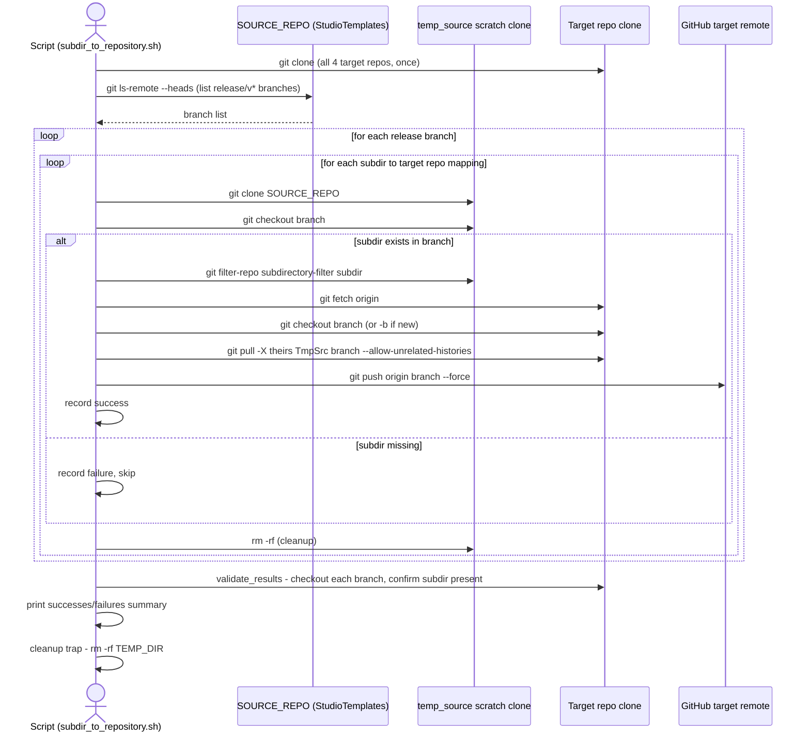
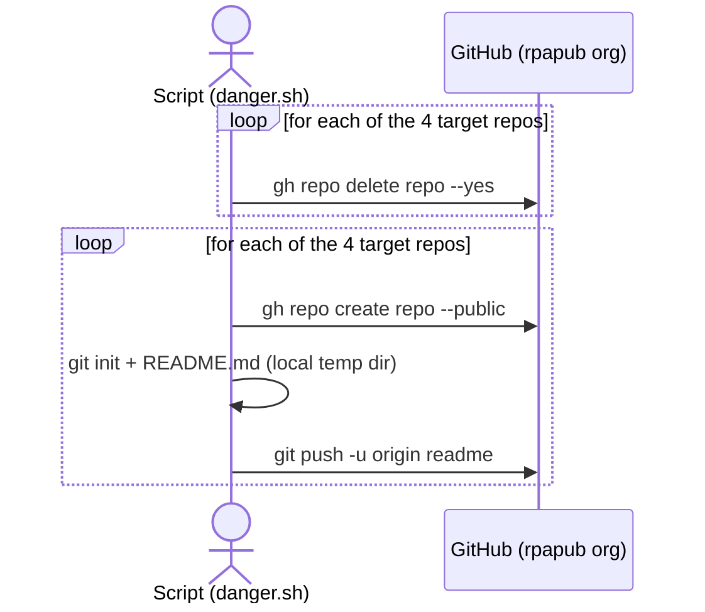

# Diagrams

## `subdir_to_repository.sh` — extraction & push flow

```mermaid
sequenceDiagram
    actor Runner as Script (subdir_to_repository.sh)
    participant Source as SOURCE_REPO (StudioTemplates)
    participant TmpSrc as temp_source scratch clone
    participant Target as Target repo clone
    participant Remote as GitHub target remote

    Runner->>Target: git clone (all 4 target repos, once)

    Runner->>Source: git ls-remote --heads (list release/v* branches)
    Source-->>Runner: branch list

    loop for each release branch
        loop for each subdir to target repo mapping
            Runner->>TmpSrc: git clone SOURCE_REPO
            Runner->>TmpSrc: git checkout branch
            alt subdir exists in branch
                Runner->>TmpSrc: git filter-repo subdirectory-filter subdir
                Runner->>Target: git fetch origin
                Runner->>Target: git checkout branch (or -b if new)
                Runner->>Target: git pull -X theirs TmpSrc branch --allow-unrelated-histories
                Runner->>Remote: git push origin branch --force
                Runner->>Runner: record success
            else subdir missing
                Runner->>Runner: record failure, skip
            end
            Runner->>TmpSrc: rm -rf (cleanup)
        end
    end

    Runner->>Target: validate_results - checkout each branch, confirm subdir present
    Runner->>Runner: print successes/failures summary
    Runner->>Runner: cleanup trap - rm -rf TEMP_DIR
```

## `danger.sh` — target repo reset flow

```mermaid
sequenceDiagram
    actor Runner as Script (danger.sh)
    participant Remote as GitHub (rpapub org)

    loop for each of the 4 target repos
        Runner->>Remote: gh repo delete repo --yes
    end

    loop for each of the 4 target repos
        Runner->>Remote: gh repo create repo --public
        Runner->>Runner: git init + README.md (local temp dir)
        Runner->>Remote: git push -u origin readme
    end
```
